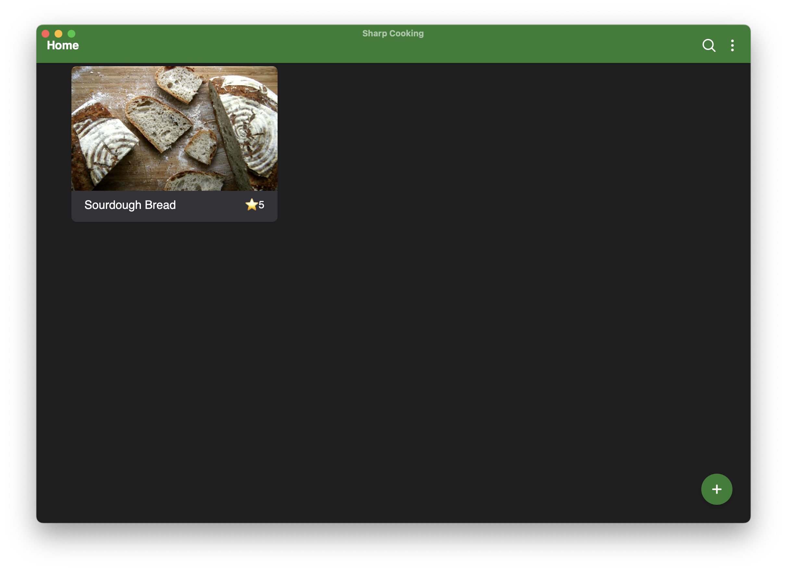

# Sharp Cooking Desktop

Sharp Cooking is a recipe book app for macOS and Windows. It lets you store, organize, and cook from your personal recipe collection — with features like step-by-step cooking mode, ingredient scaling, and recipe import from the web.



## Getting Started

Download the latest version for your platform from the [Releases page](../../releases/latest):

- **macOS** — download `sharp-cooking-*-macos-universal.zip`, unzip, and drag **Sharp Cooking.app** to your Applications folder.
  > The app is not signed, so macOS may block it on first launch. If that happens, go to **Settings → Privacy & Security** and click **Open Anyway**.
- **Windows** — download `sharp-cooking-*-windows-amd64-installer.exe` and run the installer.

## Development

### Prerequisites

- [Go 1.23+](https://go.dev/)
- [Node.js 20+](https://nodejs.org/) and [Yarn](https://yarnpkg.com/)
- [Wails CLI v2.12](https://wails.io/docs/gettingstarted/installation)

Install the Wails CLI:

```bash
go install github.com/wailsapp/wails/v2/cmd/wails@v2.12.0
```

### Clone

```bash
git clone --recurse-submodules https://github.com/jlucaspains/sharp-cooking-desktop.git
cd sharp-cooking-desktop
```

### Run in development mode

```bash
wails dev
```

This starts a Vite dev server with hot reload. The app is also accessible at `http://localhost:34115` in a browser.

### Build

```bash
wails build                             # current platform
wails build -platform darwin/universal  # macOS universal binary
wails build -nsis                       # Windows installer
```
